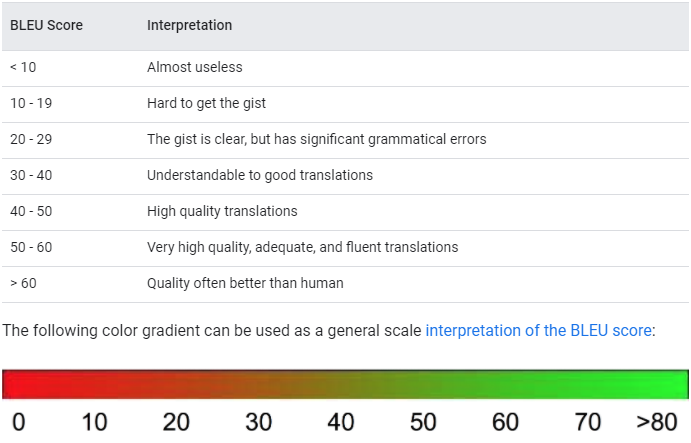
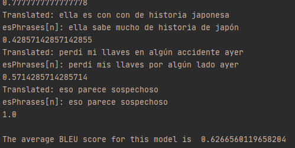

# EnglishSpanishNMT

## Summary
This is a program made to translate Spanish phrases to their English counterpart through a trained model.
I take a Spanish-English parallel corpus and preprocess this into data which I can feed into a multi-layer
recurrent neural network model to get accurate predictions. PyQt5 is used as the user interface where input can be
given to the model.

## Data taken
[Tatoeba corpus](http://opus.nlpl.eu/Tatoeba.php)
[Article here](http://www.lrec-conf.org/proceedings/lrec2012/pdf/463_Paper.pdf)

## Data Preprocessing
Through parsing the entire Tatoeba dataset, a file is created that contains only the phrase pairings that contain 
the top 20% most used words in the dataset. This allows for less noise in the data, although restricting the
variety of words the model sees in training. The percentage can be changed to allow for more or less word inclusion.

Phrases in this file are shuffled to enable the test and training sets to contain the same lengths of sentences on average. 
The words in the phrases in this file are separated by language, then tokenized and put into integer format based upon their frequency through a Keras Tokenizer. Instead of a list of phrases, there are now two two-dimensional arrays of integers 
which can be translated to their respective words at any time. These two arrays are then padded to the length of their
longest phrase.

The padded English array is our model input, and the padded Spanish array is the model output.

## Model Training
A Keras Sequential model with five layers (Embedding, two Bidirectional, RepeatVector, and a Dense layer with a 
softmax activation) is used. This model is trained for 50 epochs with a batch size of 64, learning rate of .0001, 
and takes a 20 percent validation split.

## Test Results
The test set is taken from 20 percent of the total data and used to judge the accuracy of the model by comparing candidate
sentences (translations by the model, or the models output given 'y_train') to reference phrases (the real translations, or 'y_test').

Accuracy is given in the form of a BLEU (bilingual evaluation understudy) score. 

> A rough reference for the BLEU score metric.

Since the BLEU score's recommended use is as a corpus-wide metric, we add every candidate and reference sentence to a respective list
and calculate the BLEU score from these two lists. 

> EnglishSpanishNMT's BLEU score evaluation on the test set.

The model gives an outstanding score of above 60, which translates (obligatory pun) to a model that can preform better than 
human translators on average. This is misleading however, as this score is obtained on a test set that is in turn obtained from a
dataset which contents are vetted based on whether individual phrases contain only high frequency words. I.e. this 
score is only applicable as a valid metric for performance given the words used are the words above the frequency threshold
in the original dataset. 

Fortunately, due to the Pareto principle, the majority of common words should be included above this threshold, so the
model should have a high accuracy rate on simple sentences. But as the addition of more obscure words rises, the
predicted accuracy of this model plummets. A greater data gathering and preprocessing effort would have to be
undertaken to solve this problem, which is out of the scope of this project's intention.

## User Interface
Using the PyQt5 library, a MainWindow class holds two text boxes which takes English input and outputs the Spanish
prediction of the model.
